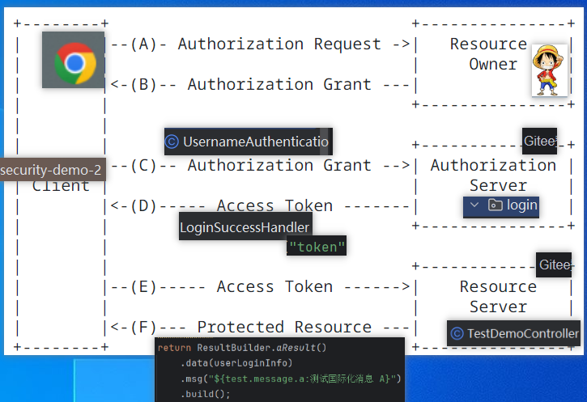
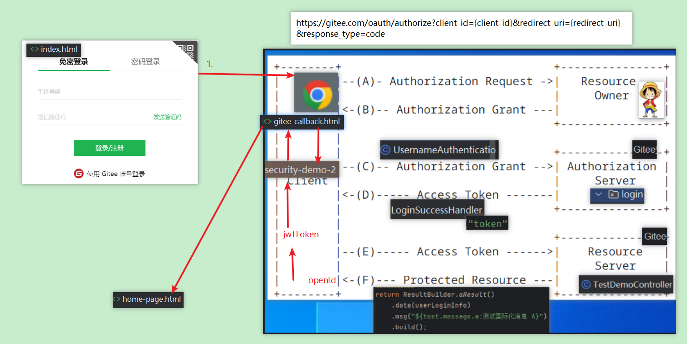
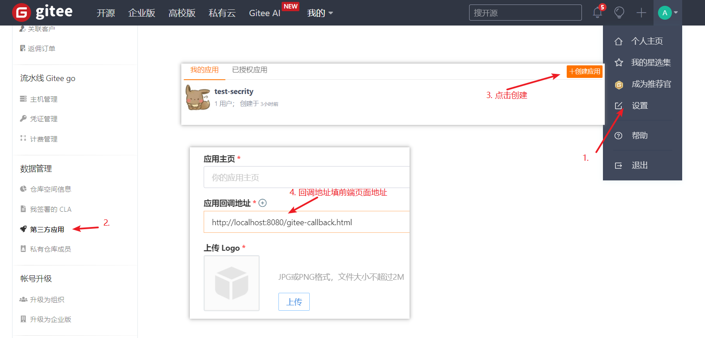

# Spring Security 6 教程
## 通用的权限框架需求
### 1. 所有API响应数据格式需要统一。示例：
```json
{
  "code": "success",
  "message": "description",
  "data": null
}
```
      ps:
      code: 状态码，后台定义给前端用，比如“token.expired”，前端收到这个状态码后，会立刻去调用刷新token接口
      message: 状态码含义描述，可以做国际化翻译。不同语言返回不同的翻译版本
      重点：正常情况 和 异常情况 返回的数据格式都必须一样

### 2. 支持多种方式登录

比如：用户名+密码登录，手机号+短信登录

2.1 使用oauth2登录

支持Oauth2登录的方式比如：微信扫码登录、QQ登录、facebook登录、google账号登录、Apple账号登录、Gitee登录

oauth2标准定义：

https://datatracker.ietf.org/doc/html/rfc6749



使用AI生成代码，提示词：

我正在测试oauth2三方授权登录，需要你帮我实现前端页面代码，尽量美观一点，要有商业风格：

1.首选创建一个index.html代码，在页面正中间创建一个按钮：Gitee授权登录

2.点击按钮时，先GET请求http://localhost:8080/public/login/gitee/config接口，这个会返回json数据：{"data": {"clientId":"clientId...","redirectUri":"redirectUri..."}}。 得到json数据后替换替换这个url（https://gitee.com/oauth/authorize?client_id={client_id}&redirect_uri={redirect_uri}&response_type=code）请求参数中的动态参数{client_id}和{redirect_uri}，得到一个三方授权页面的完整url，最后重定向到这个url。用户汇在这个页面中进行确认授权

3.创建一个新的html页面gitee-callback.html

4.当用户授权完毕，gitee服务器会重定向到一个这个新的页面（http://localhost:8080/gitee-callback.html），同时url上面会带上请求参数code。当重定向请求到达后，需要自动提取url上面的code，同时发post请求到后台服务器（http://localhost:8080/user/login/gitee），请求body数据{code:"..."}，响应数据{"message": "登录信息...", "data":{"nickname": "用户昵称"}}，得到响应数据后，提取中message字段中的数据，重定向到一个新的页面home-page.html，同时在home-page.html中展示message + 'hello, ' + nickname信息（home-page.html也请帮我实现）



### 3. 支持多种资源API鉴权

比如，自家用户请求API时鉴权。对外提供开放API使用的是md5签名验签鉴权，或其他自定义鉴权

## 附录
### SpringSecurity框架默认配置存在的问题
1. 拦截了所有请求，如何放行？
2. 错误拦截返回的数据结构不统一

### Gitee授权登录请求

1. 到(地址：https://gitee.com/oauth/applications)Gitee个人中心 -> 设置 -> 三方应用 中，创建应用，获取到ClientId/ClientSecret填写到yml配置中（login.gitee）

   其中，重定向地址填：http://localhost:8080/gitee-callback.html



2. 启动项目，访问 http://localhost:8080，可测试gitee授权登录

## 外部文档

SpringSecurity中文文档：


https://springdoc.cn/spring-security/servlet/architecture.html


配套视频讲解：

https://www.bilibili.com/video/BV1Ux4y1E7kV