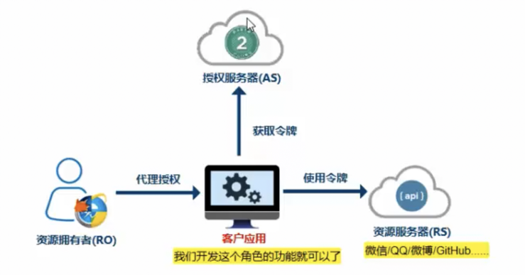

好的，我再详细形象地解释一下这些依赖的用途和区别。



1. **`spring-boot-starter-oauth2-resource-server`**：

   角色：资源服务器（Resource Server）

   比喻：想象一个图书馆（资源服务器），它有很多书（受保护的资源）。只有持有有效借书证（访问令牌）的人才能借书（访问资源）。

   功能：保护资源，验证和授权访问令牌，确保只有授权的客户端能访问受保护的资源。

   使用场景：当你的应用程序中有需要保护的 API 或数据时，你会使用这个依赖来确保只有授权用户能访问这些资源。

2. **`spring-boot-starter-oauth2-client`**：

   角色：OAuth2 客户端（Client）

   比喻：想象一个用户（客户端），他想从图书馆（资源服务器）借书，但他需要先从图书馆管理处（授权服务器）获得借书证（访问令牌）。

   功能：与授权服务器交互，获取和管理访问令牌，用以访问受保护的资源。

   使用场景：当你的应用程序需要访问其他受保护的资源服务器时，你会使用这个依赖来获取访问令牌。

3. **`spring-boot-starter-oauth2-authorization-server`**：

   角色：授权服务器（Authorization Server）

   比喻：想象一个图书馆管理处（授权服务器），它负责发放借书证（访问令牌）。只有经过图书馆管理处验证身份（用户认证）的人，才能拿到借书证。

   功能：处理用户身份验证，生成并发放访问令牌，支持多种授权模式（如授权码、密码模式等）。

   使用场景：当你的应用程序需要作为授权服务器，负责用户认证并发放访问令牌时，你会使用这个依赖。

总结：

- **资源服务器**：保护资源，验证访问令牌，确保只有授权的客户端能访问资源。
- **OAuth2 客户端**：从授权服务器获取访问令牌，用以访问资源服务器上的受保护资源。
- **授权服务器**：进行用户认证，发放访问令牌，允许客户端获取访问资源服务器的权限。

### 可以搭建一个示例?

当然可以！我们来构建一个简单的 Spring Boot 项目，包括 OAuth2 授权服务器、资源服务器和客户端，展示它们的交互过程。

### 项目结构

1. **authorization-server**：授权服务器
2. **resource-server**：资源服务器
3. **client**：OAuth2 客户端

### 授权服务器 (authorization-server)

**依赖项 (`pom.xml`)**：

```xml

<dependencies>
    <dependency>
        <groupId>org.springframework.boot</groupId>
        <artifactId>spring-boot-starter-oauth2-authorization-server</artifactId>
    </dependency>
</dependencies>
```

**配置类 (`AuthorizationServerConfig.java`)**：

```java
import org.springframework.context.annotation.Configuration;
import org.springframework.security.config.annotation.web.builders.HttpSecurity;
import org.springframework.security.oauth2.config.annotation.web.configuration.EnableAuthorizationServer;
import org.springframework.security.oauth2.config.annotation.web.configuration.AuthorizationServerConfigurerAdapter;
import org.springframework.security.oauth2.config.annotation.web.configurers.AuthorizationServerEndpointsConfigurer;
import org.springframework.security.oauth2.config.annotation.web.configurers.AuthorizationServerSecurityConfigurer;

@Configuration
@EnableAuthorizationServer
public class AuthorizationServerConfig extends AuthorizationServerConfigurerAdapter {

    @Override
    public void configure(AuthorizationServerSecurityConfigurer security) throws Exception {
        security.tokenKeyAccess("permitAll()")
                .checkTokenAccess("isAuthenticated()");
    }

    @Override
    public void configure(ClientDetailsServiceConfigurer clients) throws Exception {
        clients.inMemory()
                .withClient("client")
                .secret("{noop}secret")
                .authorizedGrantTypes("authorization_code", "refresh_token")
                .scopes("read")
                .redirectUris("http://localhost:8082/login/oauth2/code/client");
    }

    @Override
    public void configure(AuthorizationServerEndpointsConfigurer endpoints) throws Exception {
        // 配置令牌存储等
    }
}
```

**应用程序主类 (`AuthorizationServerApplication.java`)**：

```java
import org.springframework.boot.SpringApplication;
import org.springframework.boot.autoconfigure.SpringBootApplication;

@SpringBootApplication
public class AuthorizationServerApplication {
    public static void main(String[] args) {
        SpringApplication.run(AuthorizationServerApplication.class, args);
    }
}
```

### 资源服务器 (resource-server)

**依赖项 (`pom.xml`)**：

```xml

<dependencies>
    <dependency>
        <groupId>org.springframework.boot</groupId>
        <artifactId>spring-boot-starter-oauth2-resource-server</artifactId>
    </dependency>
</dependencies>
```

**配置类 (`ResourceServerConfig.java`)**：

```java
import org.springframework.context.annotation.Configuration;
import org.springframework.security.config.annotation.web.builders.HttpSecurity;
import org.springframework.security.config.annotation.web.configuration.EnableWebSecurity;
import org.springframework.security.config.annotation.web.configuration.WebSecurityConfigurerAdapter;
import org.springframework.security.oauth2.config.annotation.web.configuration.EnableResourceServer;

@Configuration
@EnableResourceServer
public class ResourceServerConfig extends WebSecurityConfigurerAdapter {

    @Override
    protected void configure(HttpSecurity http) throws Exception {
        http.authorizeRequests()
                .antMatchers("/public").permitAll()
                .anyRequest().authenticated();
    }
}
```

**资源控制器 (`ResourceController.java`)**：

```java
import org.springframework.web.bind.annotation.GetMapping;
import org.springframework.web.bind.annotation.RestController;

@RestController
public class ResourceController {

    @GetMapping("/public")
    public String publicEndpoint() {
        return "This is a public endpoint.";
    }

    @GetMapping("/protected")
    public String protectedEndpoint() {
        return "This is a protected endpoint.";
    }
}
```

**应用程序主类 (`ResourceServerApplication.java`)**：

```java
import org.springframework.boot.SpringApplication;
import org.springframework.boot.autoconfigure.SpringBootApplication;

@SpringBootApplication
public class ResourceServerApplication {
    public static void main(String[] args) {
        SpringApplication.run(ResourceServerApplication.class, args);
    }
}
```

### 客户端 (client)

**依赖项 (`pom.xml`)**：

```xml

<dependencies>
    <dependency>
        <groupId>org.springframework.boot</groupId>
        <artifactId>spring-boot-starter-oauth2-client</artifactId>
    </dependency>
</dependencies>
```

**配置类 (`SecurityConfig.java`)**：

```java
import org.springframework.context.annotation.Configuration;
import org.springframework.security.config.annotation.web.builders.HttpSecurity;
import org.springframework.security.config.annotation.web.configuration.EnableWebSecurity;
import org.springframework.security.config.annotation.web.configuration.WebSecurityConfigurerAdapter;
import org.springframework.security.oauth2.client.oidc.web.logout.OidcClientInitiatedLogoutSuccessHandler;
import org.springframework.security.oauth2.client.registration.ClientRegistrationRepository;
import org.springframework.security.oauth2.core.oidc.endpoint.OidcParameterNames;

@Configuration
@EnableWebSecurity
public class SecurityConfig extends WebSecurityConfigurerAdapter {

    private final ClientRegistrationRepository clientRegistrationRepository;

    public SecurityConfig(ClientRegistrationRepository clientRegistrationRepository) {
        this.clientRegistrationRepository = clientRegistrationRepository;
    }

    @Override
    protected void configure(HttpSecurity http) throws Exception {
        http
                .authorizeRequests(authorizeRequests ->
                        authorizeRequests.anyRequest().authenticated()
                )
                .oauth2Login(oauth2Login ->
                        oauth2Login.defaultSuccessUrl("/home", true)
                )
                .logout(logout -> logout
                        .logoutSuccessHandler(new OidcClientInitiatedLogoutSuccessHandler(clientRegistrationRepository))
                );
    }
}
```

**控制器 (`ClientController.java`)**：

```java
import org.springframework.web.bind.annotation.GetMapping;
import org.springframework.web.bind.annotation.RestController;
import org.springframework.security.oauth2.client.OAuth2AuthorizedClientService;
import org.springframework.security.oauth2.client.OAuth2AuthorizedClient;
import org.springframework.security.oauth2.core.oidc.user.OidcUser;

@RestController
public class ClientController {

    private final OAuth2AuthorizedClientService authorizedClientService;

    public ClientController(OAuth2AuthorizedClientService authorizedClientService) {
        this.authorizedClientService = authorizedClientService;
    }

    @GetMapping("/home")
    public String home(OidcUser oidcUser) {
        return "Welcome, " + oidcUser.getFullName();
    }
}
```

**应用程序主类 (`ClientApplication.java`)**：

```java
import org.springframework.boot.SpringApplication;
import org.springframework.boot.autoconfigure.SpringBootApplication;

@SpringBootApplication
public class ClientApplication {
    public static void main(String[] args) {
        SpringApplication.run(ClientApplication.class, args);
    }
}
```

### 运行步骤

1. 启动授权服务器 (`AuthorizationServerApplication`)。
2. 启动资源服务器 (`ResourceServerApplication`)。
3. 启动客户端 (`ClientApplication`)。
4. 在浏览器中访问 `http://localhost:8082`（客户端地址），将被重定向到授权服务器进行登录。
5. 登录成功后，将被重定向回客户端，显示欢迎信息。
6. 可以使用获取到的令牌访问资源服务器的受保护资源（例如，`http://localhost:8081/protected`）。

这样，你就可以看到 OAuth2 授权服务器、资源服务器和客户端之间的交互了。