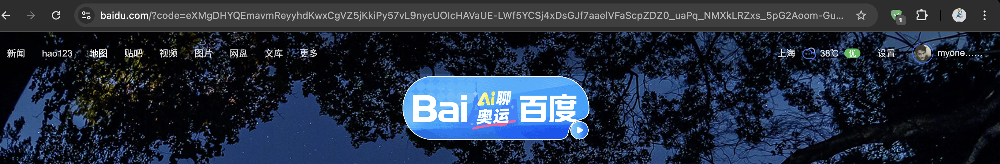
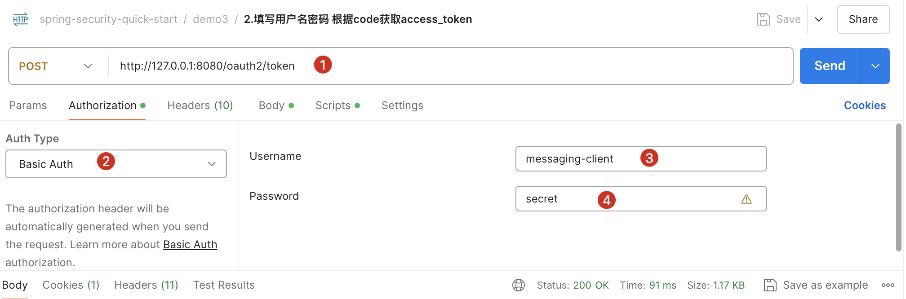
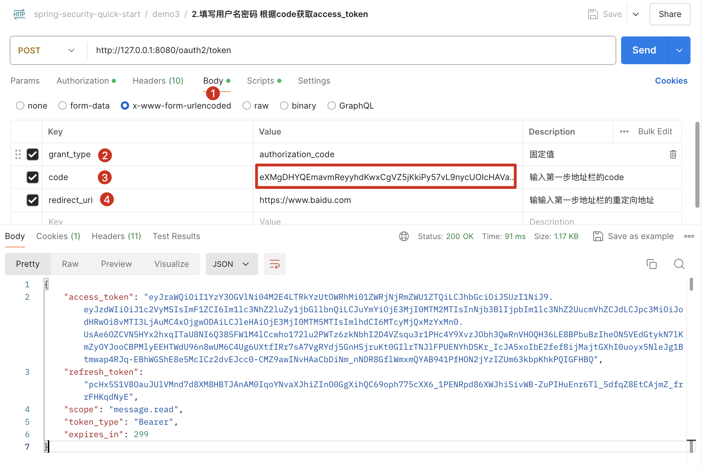
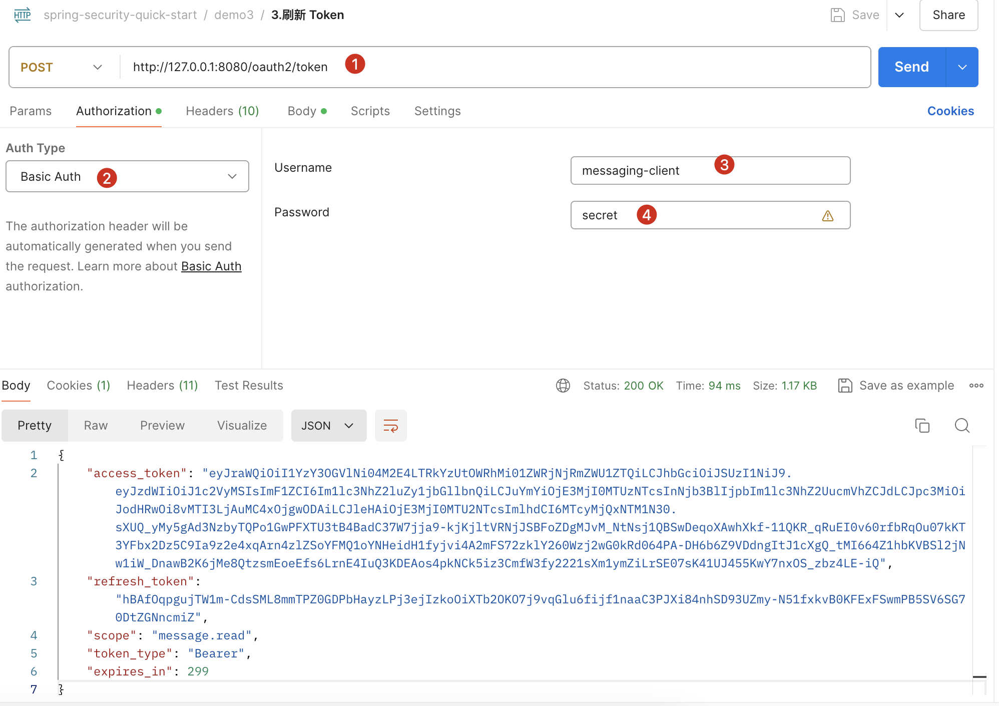
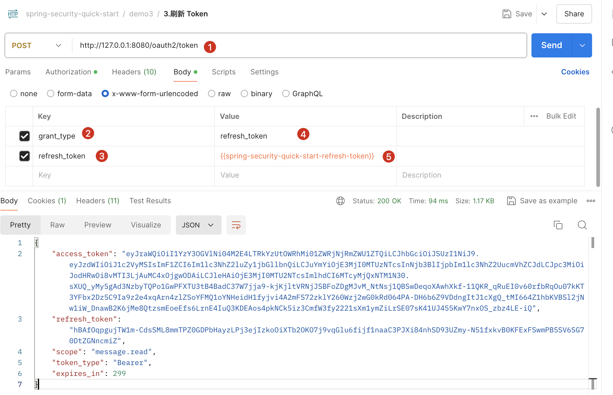
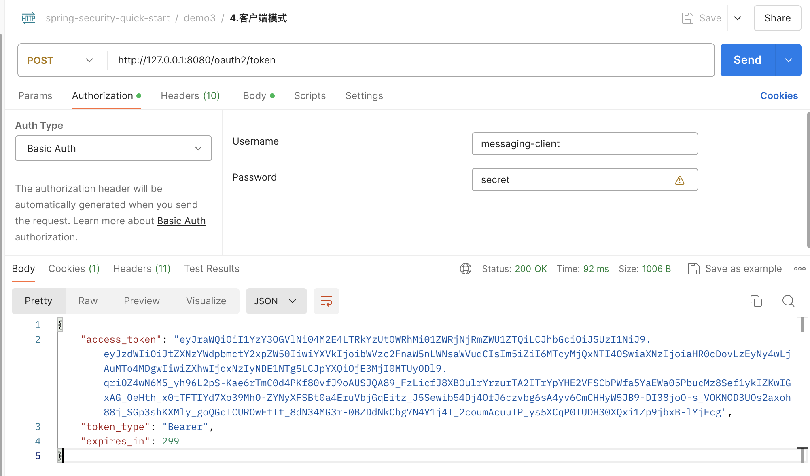
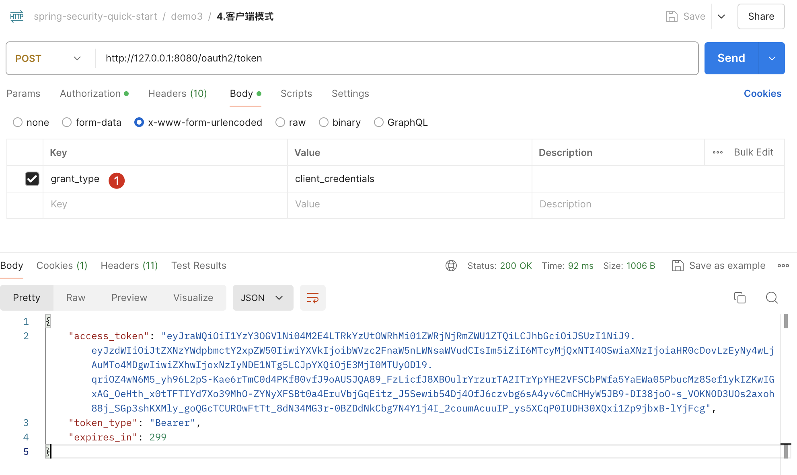

# Getting Started

最最最最简单的授权服务器的搭建


## 一、示例代码

```xml
<?xml version="1.0" encoding="UTF-8"?>
<project xmlns="http://maven.apache.org/POM/4.0.0"
         xmlns:xsi="http://www.w3.org/2001/XMLSchema-instance"
         xsi:schemaLocation="http://maven.apache.org/POM/4.0.0 http://maven.apache.org/xsd/maven-4.0.0.xsd">
    <modelVersion>4.0.0</modelVersion>

    <parent>
        <groupId>org.springframework.boot</groupId>
        <artifactId>spring-boot-starter-parent</artifactId>
        <version>3.1.0</version>
    </parent>

    <groupId>com.sample.springboot3</groupId>
    <artifactId>default-authorization-server</artifactId>
    <version>1.0.0-SNAPSHOT</version>
    <packaging>jar</packaging>

    <dependencies>
        <dependency>
            <groupId>org.springframework.boot</groupId>
            <artifactId>spring-boot-starter-web</artifactId>
        </dependency>

        <dependency>
            <groupId>org.springframework.boot</groupId>
            <artifactId>spring-boot-starter-security</artifactId>
        </dependency>
        <dependency>
            <groupId>org.springframework.security</groupId>
            <artifactId>spring-security-oauth2-authorization-server</artifactId>
            <version>1.1.0</version>
        </dependency>

        <dependency>
            <groupId>org.springframework.boot</groupId>
            <artifactId>spring-boot-starter-test</artifactId>
            <scope>test</scope>
        </dependency>
        <dependency>
            <groupId>org.springframework.security</groupId>
            <artifactId>spring-security-test</artifactId>
            <scope>test</scope>
        </dependency>
        <dependency>
            <groupId>org.junit.jupiter</groupId>
            <artifactId>junit-jupiter</artifactId>
            <scope>test</scope>
        </dependency>
        <dependency>
            <groupId>net.sourceforge.htmlunit</groupId>
            <artifactId>htmlunit</artifactId>
            <scope>test</scope>
        </dependency>
    </dependencies>

</project>
```


```yaml
server:
  port: 8080  # 配置应用程序的服务器端口为 8080

logging:
  level:
    org.springframework.security: trace  # 设置 Spring Security 的日志级别为 TRACE，以便进行详细的调试日志记录

spring:
  security:
    user:
      name: user1  # 配置默认内存用户的用户名为 user1
      password: 123  # 配置默认内存用户的密码为 123
    oauth2:
      authorization-server:
        client:
          messaging-client:
            registration:
              client-id: "messaging-client"  # 配置 OAuth2 客户端的 ID 为 messaging-client
              client-secret: "{noop}secret"  # 配置 OAuth2 客户端的密钥，使用 {noop} 表示不进行加密
              client-authentication-methods:
                - "client_secret_basic"  # 配置客户端认证方法为 client_secret_basic
              authorization-grant-types:
                - "authorization_code"  # 配置授权类型为授权码模式
                - "refresh_token"  # 配置授权类型为刷新令牌模式
                - "client_credentials"  # 配置授权类型为客户端凭证模式
              redirect-uris:
                - "https://www.baidu.com"  # 配置授权成功后的重定向 URI
              post-logout-redirect-uris:
                - "http://127.0.0.1:8080/logged-out"  # 配置注销后的重定向 URI
              scopes:
                - "openid"  # 配置授权范围 openid
                - "profile"  # 配置授权范围 profile
                - "message.read"  # 配置授权范围 message.read
                - "message.write"  # 配置授权范围 message.write
            require-authorization-consent: true  # 配置客户端要求用户在授权时进行确认

```


## 二、授权码模式

### 1.获取授权码 (code)

在浏览器访问

```plaintext
http://localhost:8080/oauth2/authorize?response_type=code&client_id=messaging-client&scope=message.read&redirect_uri=https://www.baidu.com
```

这个链接可以引导用户登录，并获取授权码 (code)。



重定向到我们配置的redirect_uri=https://www.baidu.com 并且携带上了code！

https://www.baidu.com/?code=Xg7Or0ZM0a0V1gTTFE4CPGpRZh4Xe5SYI0r78kB0fB9OfNrglqtmMS9ROS697_Dk3GQRzg6blbXeYzsT7wJ6VlEFztWOmrwUCoErQMGqs-fYk9w3Z6kwg-M82EaUHHhg

获取地址栏的授权码

```
Xg7Or0ZM0a0V1gTTFE4CPGpRZh4Xe5SYI0r78kB0fB9OfNrglqtmMS9ROS697_Dk3GQRzg6blbXeYzsT7wJ6VlEFztWOmrwUCoErQMGqs-fYk9w3Z6kwg-M82EaUHHhg
```

### 2.授权码换访问令牌和刷新令牌



* 1
* 2 
* 3 填写    client-id: "messaging-client"  # 配置 OAuth2 客户端的 ID 为 messaging-client
* 4 填写     client-secret: "{noop}secret"  # 配置 OAuth2 客户端的密钥，使用 {noop} 表示不进行加密



后置脚本

```
// 获取响应数据
var response = pm.response.json();

// 将 access_token 存储到全局变量
pm.globals.set("spring-security-quick-start-access-token", response.access_token);

// 将 refresh_token 存储到全局变量
pm.globals.set("spring-security-quick-start-refresh-token", response.refresh_token);

// 打印全局变量的值以供调试
console.log("Access Token: " + pm.globals.get("spring-security-quick-start-access-token"));
console.log("Refresh Token: " + pm.globals.get("spring-security-quick-start-refresh-token"));

```


### 3.刷新token

认证信息



参数




## 三、客户端模式



