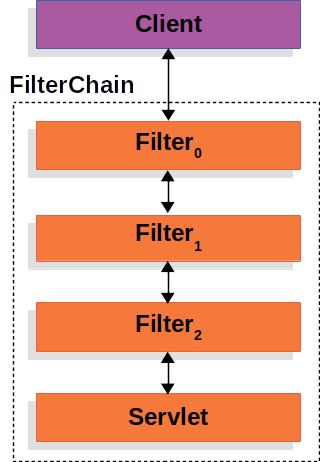
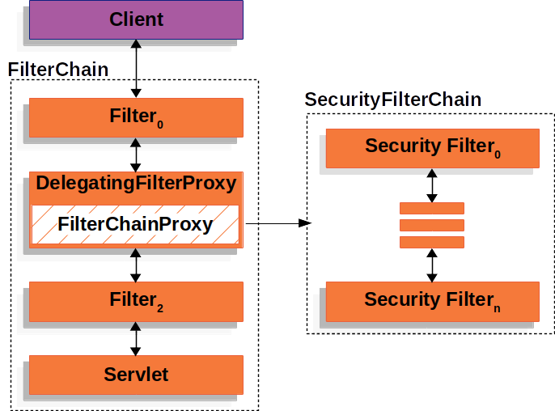

项目目录结构：

* authorization-module 权限模块 [语雀文档](https://www.yuque.com/nines-_-/iuag2x/ugg2h5lxatdv2gh5)
* common-module 公共模块
* service-module 服务模块
* demo-springboot-filter 过滤器回顾 示例

  

了解更多 https://springdoc.cn/spring-security/servlet/index.html

**本讨论对 [Servlet Security](https://springdoc.cn/spring-security/servlet/architecture.html#servlet-architecture) 进行了扩展。[架构图](https://springdoc.cn/spring-security/servlet/architecture.html#servlet-architecture) 阐述了 Spring Security 用于 Servlet 认证的主要架构组件。如果你需要具体的流程来解释这些部分是如何结合在一起的，请看 [认证机制](https://springdoc.cn/spring-security/servlet/authentication/index.html#servlet-authentication-mechanisms) 的具体章节。**

- **[SecurityContextHolder](https://springdoc.cn/spring-security/servlet/authentication/architecture.html#servlet-authentication-securitycontextholder) - `SecurityContextHolder` 是 Spring Security 存储 [认证](https://springdoc.cn/spring-security/features/authentication/index.html#authentication) 用户细节的地方。**
- **[SecurityContext](https://springdoc.cn/spring-security/servlet/authentication/architecture.html#servlet-authentication-securitycontext) - 是从 `SecurityContextHolder` 获得的，包含了当前认证用户的 `Authentication` （认证）。**
- **[Authentication](https://springdoc.cn/spring-security/servlet/authentication/architecture.html#servlet-authentication-authentication) - 可以是 `AuthenticationManager` 的输入，以提供用户提供的认证凭证或来自 `SecurityContext` 的当前用户。**
- **[GrantedAuthority](https://springdoc.cn/spring-security/servlet/authentication/architecture.html#servlet-authentication-granted-authority) - 在 `Authentication` （认证）中授予委托人的一种权限（即role、scope等）。**
- **[AuthenticationManager](https://springdoc.cn/spring-security/servlet/authentication/architecture.html#servlet-authentication-authenticationmanager) - 定义 Spring Security 的 Filter 如何执行 [认证](https://springdoc.cn/spring-security/features/authentication/index.html#authentication) 的API。**
- **[ProviderManager](https://springdoc.cn/spring-security/servlet/authentication/architecture.html#servlet-authentication-providermanager) - 最常见的 `AuthenticationManager` 的实现。**
- **[AuthenticationProvider](https://springdoc.cn/spring-security/servlet/authentication/architecture.html#servlet-authentication-authenticationprovider) - 由 `ProviderManager` 用于执行特定类型的认证。**
- **[用 `AuthenticationEntryPoint` 请求凭证](https://springdoc.cn/spring-security/servlet/authentication/architecture.html#servlet-authentication-authenticationentrypoint) - 用于从客户端请求凭证（即重定向到登录页面，发送 `WWW-Authenticate` 响应，等等）。**
- **[AbstractAuthenticationProcessingFilter](https://springdoc.cn/spring-security/servlet/authentication/architecture.html#servlet-authentication-abstractprocessingfilter) - 一个用于认证的基本 `Filter`。这也让我们很好地了解了认证的高层流程以及各部分是如何协作的。*

## 架构

## Filter（过滤器）回顾

Spring Security 对 Servlet 的支持是基于Servlet过滤器的，所以先看一下过滤器的一般作用是很有帮助的。下图显示了单个HTTP请求的处理程序的典型分层。

## DelegatingFilterProxy

下面是 `DelegatingFilterProxy` 如何融入 [`Filter` 实例和 `FilterChain` 的](https://springdoc.cn/spring-security/servlet/architecture.html#servlet-filters-review)图片。

## FilterChainProxy

下图显示了 `FilterChainProxy` 的作用。

## SecurityFilterChain

`SecurityFilterChain` 中的 [Security Filter](https://springdoc.cn/spring-security/servlet/architecture.html#servlet-security-filters) 通常是Bean，但它们是用 `FilterChainProxy` 而不是 [DelegatingFilterProxy](https://springdoc.cn/spring-security/servlet/architecture.html#servlet-delegatingfilterproxy) 注册的。与直接向Servlet容器或 [DelegatingFilterProxy](https://springdoc.cn/spring-security/servlet/architecture.html#servlet-delegatingfilterproxy) 注册相比，`FilterChainProxy` 有很多优势。首先，它为 [ Spring](https://springdoc.cn/spring-security/servlet/architecture.html#) Security 的所有 Servlet 支持提供了一个起点。由于这个原因，如果你试图对 Spring Security 的 Servlet 支持进行故障诊断，在 `FilterChainProxy` 中添加一个调试点是一个很好的开始。

其次，由于 `FilterChainProxy` 是 Spring Security 使用的核心，它可以执行一些不被视为可有可无的任务。 例如，它清除了 `SecurityContext` 以避免内存泄漏。它还应用Spring Security的 [`HttpFirewall`](https://springdoc.cn/spring-security/servlet/exploits/firewall.html#servlet-httpfirewall) 来保护应用程序免受某些类型的攻击。

此外，它在确定何时应该调用 `SecurityFilterChain` 方面提供了更大的灵活性。在Servlet容器中，`Filter` 实例仅基于URL被调用。 然而，`FilterChainProxy` 可以通过使用 `RequestMatcher` 接口，根据 `HttpServletRequest` 中的任何内容确定调用。

下图显示了多个 `SecurityFilterChain` 实例。

在 [Multiple SecurityFilterChain](https://springdoc.cn/spring-security/servlet/architecture.html#servlet-multi-securityfilterchain-figure) 图中， `FilterChainProxy` 决定应该使用哪个 `SecurityFilterChain`。只有第一个匹配的 `SecurityFilterChain` 被调用。如果请求的URL是 `/api/messages/`，它首先与 `/api/**` 的 `SecurityFilterChain0` 模式匹配，所以只有 `SecurityFilterChain0` 被调用，尽管它也与 `SecurityFilterChainn` 匹配。如果请求的URL是 `/messages/`，它与 `/api/**` 的 `SecurityFilterChain0` 模式不匹配，所以 `FilterChainProxy` 继续尝试每个 `SecurityFilterChain`。假设没有其他 `SecurityFilterChain` 实例相匹配，则调用 `SecurityFilterChainn`。

请注意，`SecurityFilterChain0` 只配置了三个 security `Filter` 实例。然而，`SecurityFilterChainn` 却配置了四个 security `Filter` 实例。值得注意的是，每个 `SecurityFilterChain` 都可以是唯一的，并且可以单独配置。事实上，如果应用程序希望 [ Spring](https://springdoc.cn/spring-security/servlet/architecture.html#) Security 忽略某些请求，那么一个 `SecurityFilterChain` 可能会有零个 security `Filter` 实例。

## Security Filter

## 处理 Security 异常

下面的图片显示了 `ExceptionTranslationFilter` 与其他组件的关系。

-  首先，`ExceptionTranslationFilter` 调用 `FilterChain.doFilter(request, response)` 来调用应用程序的其他部分。
-  如果用户没有被[ 认证](https://springdoc.cn/spring-security/servlet/architecture.html#)，或者是一个 `AuthenticationException`，那么就 *开始 认证*。
  - [SecurityContextHolder](https://springdoc.cn/spring-security/servlet/authentication/architecture.html#servlet-authentication-securitycontextholder) 被清理掉。
  - `HttpServletRequest` 被[保存](https://springdoc.cn/spring-security/servlet/architecture.html#savedrequests)起来，这样一旦认证成功，它就可以用来重放原始请求。
  - `AuthenticationEntryPoint` 用于请求客户的凭证。例如，它可以重定向到一个登录页面或发送一个 `WWW-Authenticate` 头。
-  否则，如果是 `AccessDeniedException`，那么就是 *Access Denied*。 `AccessDeniedHandler` 被调用来处理拒绝访问（access denied）。

## RequestCache

`HttpServletRequest` 被保存在 [`RequestCache`](https://docs.spring.io/spring-security/site/docs/current/api/org/springframework/security/web/savedrequest/RequestCache.html)。当用户成功认证后，`RequestCache` 被用来重放原始请求。[`RequestCacheAwareFilter`](https://springdoc.cn/spring-security/servlet/architecture.html#requestcacheawarefilter) 就是使用 `RequestCache` 来保存 `HttpServletRequest` 的。

默认情况下，使用一个 `HttpSessionRequestCache`。下面的代码演示了如何定制 `RequestCache` 的实现，如果名为 `continue` 的参数存在，它将用于检查 `HttpSession` 是否有保存的请求。

## 5.Servlet 认证架构

[`AbstractAuthenticationProcessingFilter`](https://docs.spring.io/spring-security/site/docs/current/api/org/springframework/security/web/authentication/AbstractAuthenticationProcessingFilter.html) 被用作验证用户凭证的基础 `Filter`。在认证凭证之前，Spring Security 通常通过使用[`AuthenticationEntryPoint`](https://springdoc.cn/spring-security/servlet/authentication/architecture.html#servlet-authentication-authenticationentrypoint) 来请求凭证。

接下来，`AbstractAuthenticationProcessingFilter` 可以对提交给它的任何认证请求进行认证。

 当用户提交他们的凭证时，`AbstractAuthenticationProcessingFilter` 会从 `HttpServletRequest` 中创建一个要认证的[`Authentication`](https://springdoc.cn/spring-security/servlet/authentication/architecture.html#servlet-authentication-authentication)。创建的认证的类型取决于 `AbstractAuthenticationProcessingFilter` 的子类。例如，[`UsernamePasswordAuthenticationFilter`](https://springdoc.cn/spring-security/servlet/authentication/passwords/form.html#servlet-authentication-usernamepasswordauthenticationfilter)从 `HttpServletRequest` 中提交的 *username* 和 *password* 创建一个 `UsernamePasswordAuthenticationToken`。

 接下来，[`Authentication`](https://springdoc.cn/spring-security/servlet/authentication/architecture.html#servlet-authentication-authentication) 被传入 [`AuthenticationManager`](https://springdoc.cn/spring-security/servlet/authentication/architecture.html#servlet-authentication-authenticationmanager)，以进行[ 认证](https://springdoc.cn/spring-security/servlet/authentication/architecture.html#)。

 如果认证失败，则为 *Failure*。

- [SecurityContextHolder](https://springdoc.cn/spring-security/servlet/authentication/architecture.html#servlet-authentication-securitycontextholder) 被清空。
- `RememberMeServices.loginFail` 被调用。如果没有配置记住我（remember me），这就是一个无用功。请参阅 [`rememberme`](https://docs.spring.io/spring-security/site/docs/current/api/org/springframework/security/web/authentication/rememberme/package-frame.html) 包。
- `AuthenticationFailureHandler` 被调用。参见 [`AuthenticationFailureHandler`](https://docs.spring.io/spring-security/site/docs/current/api/org/springframework/security/web/authentication/AuthenticationFailureHandler.html) 接口。

 如果认证成功，则为 *Success*。

- `SessionAuthenticationStrategy` 被通知有新的登录。参见 [`SessionAuthenticationStrategy`](https://docs.spring.io/spring-security/site/docs/current/api/org/springframework/security/web/authentication/session/SessionAuthenticationStrategy.html) 接口。
- [Authentication](https://springdoc.cn/spring-security/servlet/authentication/architecture.html#servlet-authentication-authentication) 是在 [SecurityContextHolder](https://springdoc.cn/spring-security/servlet/authentication/architecture.html#servlet-authentication-securitycontextholder) 上设置的。后来，如果你需要保存 `SecurityContext` 以便在未来的请求中自动设置，必须显式调用 `SecurityContextRepository#saveContext`。参见 [`SecurityContextHolderFilter`](https://docs.spring.io/spring-security/site/docs/current/api/org/springframework/security/web/context/SecurityContextHolderFilter.html) 类。
- `RememberMeServices.loginSuccess` 被调用。如果没有配置 remember me，这就是一个无用功。请参阅 [`rememberme`](https://docs.spring.io/spring-security/site/docs/current/api/org/springframework/security/web/authentication/rememberme/package-frame.html) 包。
- `ApplicationEventPublisher` 发布一个 `InteractiveAuthenticationSuccessEvent` 事件。
- `AuthenticationSuccessHandler` 被调用。参见 [`AuthenticationSuccessHandler`](https://docs.spring.io/spring-security/site/docs/current/api/org/springframework/security/web/authentication/AuthenticationSuccessHandler.html) 接口。

## 6.授权架构:AuthorizationManager实现

虽然用户可以实现他们自己的 `AuthorizationManager` 来控制授权的所有方面（aspect），但[ Spring](https://springdoc.cn/spring-security/servlet/authorization/architecture.html#) Security提供了一个委托的 `AuthorizationManager`，可以与个别的 `AuthorizationManager` 协作。

`RequestMatcherDelegatingAuthorizationManager` 将把请求与最合适的委托（delegate） `AuthorizationManager` 相匹配。 对于方法安全，你可以使用 `AuthorizationManagerBeforeMethodInterceptor` 和 `AuthorizationManagerAfterMethodInterceptor`。

[Authorization Manager Implementations](https://springdoc.cn/spring-security/servlet/authorization/architecture.html#authz-authorization-manager-implementations) 说明了相关的类。

Figure 1. Authorization Manager Implementations

使用这种方法，`AuthorizationManager` 实现的组合可以在授权决定上被轮询。